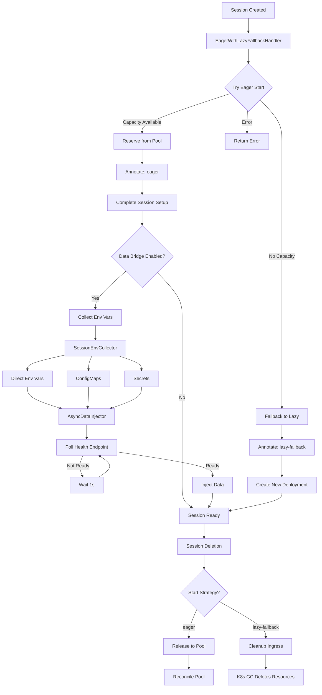

# Eager Start with Lazy Fallback

## Overview

This PR introduces an eager start strategy with automatic fallback to lazy start when prewarmed capacity is exhausted. It also adds support for asynchronous data injection via the data bridge and improves environment variable collection from multiple sources.

## Key Changes

### 1. Eager with Lazy Fallback Session Handler

Introduces `EagerWithLazyFallbackSessionHandler` that attempts eager start first, then automatically falls back to lazy start when no prewarmed capacity is available. This ensures optimal performance when capacity exists while gracefully handling capacity exhaustion.

-   Tries `EagerSessionHandler` first to use prewarmed instances
-   Falls back to `LazySessionHandler` when capacity is exhausted
-   Annotates sessions with start strategy (`eager`, `lazy-fallback`) for proper cleanup
-   Routes deletion to appropriate handler based on start strategy

### 2. Asynchronous Data Injection

Adds `AsyncDataInjector` for asynchronous credential and environment variable injection via the data bridge:

-   Polls data bridge health endpoint until ready (max 60s, 1s intervals)
-   Injects environment variables once data bridge is healthy
-   Handles injection failures gracefully with error logging
-   Uses dedicated thread pool for concurrent injection operations

### 3. Session Environment Variable Collection

Introduces `SessionEnvCollector` to aggregate environment variables from multiple sources:

-   Direct environment variables from session spec
-   ConfigMap references (resolved from Kubernetes)
-   Secret references (base64 decoded from Kubernetes)
-   Comprehensive error handling and logging

### 4. Ownership Management

Adds `OwnershipManager` utility class to centralize Kubernetes owner reference operations:

-   Consolidates ownership logic from multiple handlers
-   Provides query methods (isOwnedSolelyBy, hasOwner, hasAdditionalOwners, isOrphan)
-   Supports in-memory and API-based ownership mutations
-   Improves code maintainability and consistency

### 5. Data Bridge Strategy Support

Adds `SCORPIO_THEIA_ENV_STRATEGY` environment variable support:

-   Set to `"data-bridge"` when data bridge is enabled
-   Empty string when data bridge is disabled
-   Integrated into deployment template replacements

## Architecture

## Benefits

-   **Improved Performance**: Sessions start instantly when prewarmed capacity is available
-   **Graceful Degradation**: Automatically falls back to lazy start when capacity is exhausted
-   **Better Resource Utilization**: Prewarmed instances are reused efficiently
-   **Enhanced Flexibility**: Environment variables can be sourced from multiple Kubernetes resources
-   **Asynchronous Operations**: Data injection doesn't block session creation
-   **Code Quality**: Centralized ownership management improves maintainability

## Testing

-   Verified eager start with available capacity
-   Verified fallback to lazy start when capacity exhausted
-   Tested async data injection with data bridge
-   Validated environment variable collection from ConfigMaps and Secrets
-   Confirmed proper cleanup based on start strategy annotation

## Migration Notes

-   Existing sessions continue to work without changes
-   New sessions automatically use the eager-with-fallback strategy when eager start is enabled
-   Sessions are annotated with start strategy for proper lifecycle management
